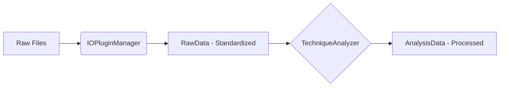

# echemistpy

**电化学与材料表征的统一数据处理框架**

echemistpy 旨在为电化学（Electrochemistry）和材料表征（XAS, STXM 等）数据提供一个统一、标准化且可扩展的处理接口。它利用 `xarray` 的强大功能来处理多维数据，并结合 `traitlets` 实现严格的元数据管理。

## 🌟 核心特性

- **多格式支持**: 自动识别并加载 Biologic (.mpt), LANHE (.xlsx), XAS (.dat), STXM (.hdf5) 等多种格式。
- **数据标准化**: 自动将不同仪器的列名和单位映射到统一标准（如 `Voltage/V`, `Current/mA`）。
- **多维数据**: 使用 `xarray.Dataset` 和 `DataTree` 处理复杂的时间序列和层级数据。
- **模块化分析**: 内置电化学分析（CV, GCD）和光谱分析（STXM, XAS）模块。

## 🚀 快速开始

### 安装

本项目使用 [uv](https://github.com/astral-sh/uv) 进行依赖管理。

1. **安装 uv** (如果尚未安装):
   ```bash
   pip install uv
   ```

2. **同步环境**:
   ```bash
   uv sync --all-groups --all-extras
   ```

### 使用示例

```python
from echemistpy.io import load

# 1. 自动检测格式加载
raw_data, raw_info = load("path/to/data.mpt", sample_name="MySample")

# 2. 访问数据 (xarray.Dataset)
print(raw_data.data)

# 3. 访问元数据
print(raw_info.to_dict())
```

## 🛠️ 开发指南

### 环境设置

```bash
# 安装开发依赖
uv sync --all-extras
```

### 代码质量检查

在提交代码前，请确保通过以下检查：

```bash
# 格式化代码
uv run ruff format src/

# Lint 检查与修复
uv run ruff check src/ --fix

# 类型检查
uv run ty check

# 运行测试
uv run pytest
```

详细规范请参考 [AGENTS.md](AGENTS.md)。

## 🏗️ 架构概览



- **RawData**: 原始数据的标准化容器。
- **RawDataInfo**: 原始元数据容器。
- **AnalysisData**: 分析结果容器。
- **TechniqueAnalyzer**: 特定技术（如 CV, STXM）的分析逻辑基类。
